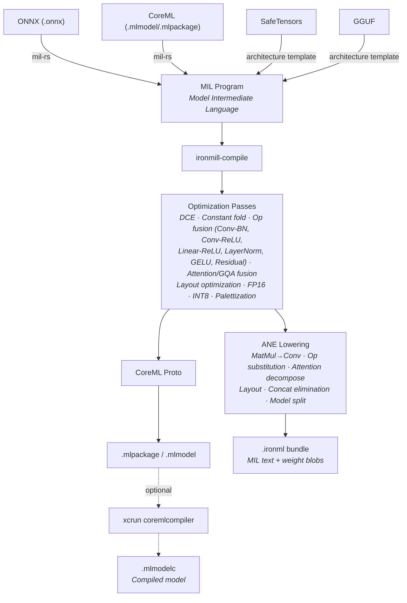
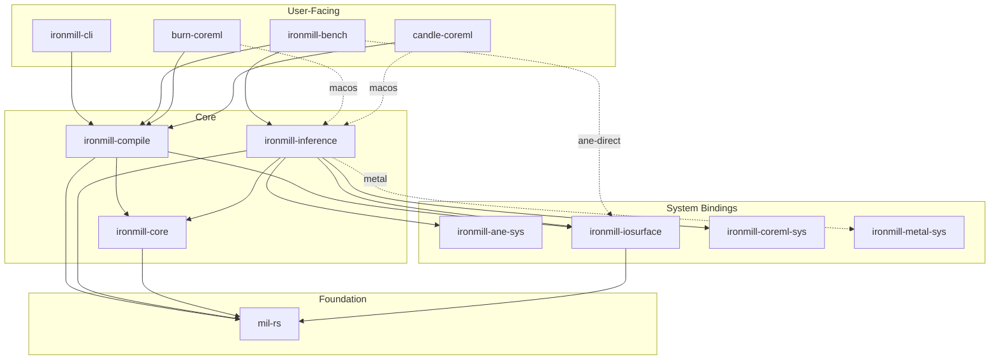

<div align="center">

# ⚙️ ironmill

[](https://github.com/jafreck/ironmill/actions)
[](LICENSE)
[](https://www.rust-lang.org)
[]()

Rust-native model compiler and GPU inference runtime for Apple Silicon.

</div>

> [!WARNING]
> **ironmill is currently in alpha and under active development.** APIs, file
> formats, and CLI interfaces may change without notice. Not recommended for
> production use.

ironmill compiles models from ONNX, SafeTensors, and GGUF into optimized
representations and runs them on Apple Silicon GPUs via Metal/MPS. It also
supports CoreML-based inference and includes an experimental direct-ANE backend
using reverse-engineered private APIs.

## Quick Start

```bash
# Install from source
cargo install --path crates/ironmill-cli

# Convert an ONNX model to CoreML
ironmill compile model.onnx

# Convert with FP16 quantization and fixed input shapes
ironmill compile model.onnx --quantize fp16 --input-shape "input:1,3,224,224"

# Inspect any model format
ironmill inspect model.onnx
ironmill inspect model.mlpackage

# Check ANE compatibility
ironmill validate model.onnx
```

## Features

### Compiler

ironmill-compile lowers models through a pipeline of optimization passes
targeting Apple's Neural Engine:

- **Model import:** ONNX, SafeTensors, GGUF, CoreML (.mlmodel/.mlpackage)
- **MIL IR:** full read/write/manipulation of Apple's Model Intermediate Language
- **Optimization passes:** dead code elimination, constant folding, identity removal
- **Op fusion:** conv+batchnorm, conv+relu, linear+relu, scaled dot-product attention
- **ANE lowering:** matmul→conv1×1, layout optimization, op substitution, shape materialization
- **Quantization:** FP16, INT8 weight-only (with optional calibration data)
- **Weight palettization:** 2/4/6/8-bit k-means compression
- **Model splitting:** automatic partitioning into ANE-sized sub-programs
- **CoreML output:** .mlpackage/.mlmodel with optional `xcrun coremlcompiler` compilation

### Inference Runtime

ironmill-inference provides three backends for running compiled models.
No dependency on ironmill-compile — it loads pre-compiled bundles only.

| | Metal GPU | CoreML | ANE-direct |
|---|:---:|:---:|:---:|
| LLM decode (autoregressive) | ✅ | — | ✅ |
| Vision / general models | ✅ | ✅ | ✅ |
| INT8 KV cache (TurboQuant) | ✅ | — | ✅ |
| Zero-copy tensor I/O | — | — | ✅ |
| Hardware scheduling | Manual | Apple-managed | Manual |
| API surface | Public (Metal/MPS) | Public (CoreML) | Private (reverse-engineered) |
| Status | **Stable** | **Stable** | **Experimental** |

#### Metal GPU

Primary backend for LLM inference. Runs on Apple Silicon GPUs via Metal
compute shaders and MPS:

- MPS-accelerated matrix multiplication for all linear layers
- Custom Metal compute kernels for RMSNorm, RoPE, SiLU, attention, and residuals
- TurboQuant INT8 KV cache with fused quantize/dequantize shaders
- Prefill and single-step decode modes

#### CoreML

Standard CoreML runtime via `MLModel`. Works with any .mlmodelc compiled
package. Apple manages ANE/GPU/CPU scheduling automatically.

#### ANE-direct *(experimental)*

Bypasses CoreML entirely using reverse-engineered private APIs
(`_ANEInMemoryModel`, `_ANECompiler`). Loads pre-compiled `.ironml` bundles
produced by ironmill-compile:

- Sub-program loading/unloading from pre-compiled bundles
- IOSurface-backed zero-copy tensor I/O
- [TurboQuant](docs/design/turboquant.md): INT8 KV cache compression with
  Hadamard rotation and on-ANE dequantization
- Autoregressive decode loop with ANE-accelerated lm_head via chunked conv1×1

### Ecosystem Integration

- **CLI:** `ironmill compile`, `inspect`, `validate`
- **C API:** stable C ABI for Swift, C++, Go, or any FFI language ([docs](docs/C_API.md))
- **Build.rs API:** compile models at build time with `CompileBuilder`
- **[candle-coreml](crates/candle-coreml/):** ONNX→CoreML conversion + runtime for [candle](https://github.com/huggingface/candle)
- **[burn-coreml](crates/burn-coreml/):** export + inference bridge for [Burn](https://github.com/tracel-ai/burn)

## Rust ML Ecosystem

ironmill sits alongside a growing ecosystem of Rust-native ML frameworks.
The candle and Burn bridge crates let you use ironmill's Metal GPU/CoreML
backends from models built in those frameworks.

| Project | Focus |
|---------|-------|
| [candle](https://github.com/huggingface/candle) | Lightweight ML framework with GPU support (candle-coreml bridge in this repo) |
| [Burn](https://github.com/tracel-ai/burn) | Modular deep learning framework with multiple backends (burn-coreml bridge in this repo) |
| [tract](https://github.com/sonos/tract) | ONNX/NNEF inference engine for edge deployment |
| [ort](https://github.com/pykeio/ort) | Rust bindings for ONNX Runtime |
| [tch-rs](https://github.com/LaurentMazare/tch-rs) | Rust bindings for the PyTorch C++ API (libtorch) |
| [dfdx](https://github.com/coreylowman/dfdx) | Compile-time typed deep learning framework |
| [luminal](https://github.com/jafioti/luminal) | Graph-based ML framework with Metal support |

## ANE Research & Related Projects

Building on [prior art](#ane-related-projects) in ANE reverse-engineering, ironmill
contributes reproducible eval-verified tests for MIL ops on Apple's Neural
Engine:

- **38 newly verified ops** (33 eval-verified, 5 compile-verified) not
  confirmed by any other open-source project
- **The epsilon discovery:** `rsqrt`, `log`, and `inverse` require an
  undocumented `epsilon` parameter; without it the compiler silently rejects
  them. Previously believed hardware-unsupported.
- **`layer_norm` on ANE:** other projects perform normalization on CPU
- **`erf` on ANE:** enables on-ANE GELU without tanh decomposition
- **Full INT8 pipeline:** `quantize`/`dequantize`/`cast` verified for
  end-to-end INT8 KV cache on ANE
- **Comparison + conditional ops:** all 6 comparison ops plus
  `select`/`logical_not` verified, enabling conditional logic on ANE

Every finding has a reproducible eval test in
[`ane_op_eval.rs`](crates/ironmill-inference/examples/ane_op_eval.rs).
See the full [ANE Op Support Matrix](docs/design/ane-op-support-matrix.md).

### ANE Related Projects

Open-source projects working with the ANE via private APIs:

- [maderix/ANE](https://github.com/maderix/ANE): ANE reverse-engineering, hardware characterization, transformer training proof-of-concept
- [mechramc/Orion](https://github.com/mechramc/Orion): ANE LLM training and inference runtime with graph IR compiler ([paper](https://arxiv.org/abs/2603.06728))
- [vipuldivyanshu92/ANEgpt](https://github.com/vipuldivyanshu92/ANEgpt): GPT-style transformer training on ANE
- [hollance/neural-engine](https://github.com/hollance/neural-engine): Community documentation of ANE capabilities

## Architecture

### Compilation Pipeline



### Crate Structure



| Crate | Description |
|-------|-------------|
| [`mil-rs`](crates/mil-rs/) | Core MIL IR library: read/write CoreML models, ONNX conversion, proto↔IR, pass pipeline |
| [`ironmill-compile`](crates/ironmill-compile/) | Compilation pipeline: ANE lowering passes, CoreML build API, templates, weight providers |
| [`ironmill-inference`](crates/ironmill-inference/) | Inference engine: ANE-direct, CoreML, and Metal GPU backends, decode loop, TurboQuant, sampling. No dependency on ironmill-compile |
| [`ironmill-core`](crates/ironmill-core/) | Shared types: bundle manifest schemas, weight provider traits, model configs, MIL text emitter |
| [`ironmill-ane-sys`](crates/ironmill-ane-sys/) | Safe FFI bindings for Apple Neural Engine private APIs (macOS-only) |
| [`ironmill-iosurface`](crates/ironmill-iosurface/) | IOSurface tensor management for ANE I/O (macOS-only) |
| [`ironmill-coreml-sys`](crates/ironmill-coreml-sys/) | CoreML runtime bindings via objc2 (macOS-only) |
| [`ironmill-metal-sys`](crates/ironmill-metal-sys/) | Safe FFI bindings for Apple Metal and MPS frameworks (macOS-only) |
| [`ironmill-cli`](crates/ironmill-cli/) | CLI: `compile`, `inspect`, `validate` commands |
| [`ironmill-bench`](crates/ironmill-bench/) | Inference benchmark harness: power, quality, perplexity metrics |
| [`candle-coreml`](crates/candle-coreml/) | Bridge crate: ONNX→CoreML conversion + runtime for candle |
| [`burn-coreml`](crates/burn-coreml/) | Bridge crate: ONNX→CoreML export + runtime for Burn |

## CLI Usage

### `ironmill compile`

```bash
ironmill compile model.onnx                                        # basic conversion
ironmill compile model.onnx -o output.mlpackage --quantize fp16    # FP16 quantization
ironmill compile model.onnx --quantize int8                        # weight-only INT8
ironmill compile model.onnx --quantize int8 --cal-data imgs/       # INT8 with calibration
ironmill compile model.onnx --palettize 4                          # 4-bit palettization
ironmill compile model.onnx --input-shape "input:1,3,224,224"      # fixed shapes for ANE
ironmill compile model.onnx --no-fusion                            # skip optimization passes
```

### `ironmill inspect`

```bash
ironmill inspect model.onnx
ironmill inspect model.mlmodel
ironmill inspect model.mlpackage
```

### `ironmill validate`

```bash
ironmill validate model.onnx
```

## Building from Source

```bash
git clone https://github.com/jafreck/ironmill.git
cd ironmill
cargo build --workspace
cargo test --workspace
```

Requires Rust 1.85+ (edition 2024).

## Documentation

- [C API](docs/C_API.md): building, linking, and calling from C/Swift/C++
- [ANE Op Support Matrix](docs/design/ane-op-support-matrix.md): verified ANE ops with eval tests
- [ANE Inference](docs/design/ane-inference.md): inference pipeline architecture
- [ANE Constraints](docs/design/ane-constraints.md): hardware limits and diagnostics
- [TurboQuant](docs/design/turboquant.md): INT8 KV cache compression design
- [Compact Cache](docs/design/compact-cache.md): cache memory optimization

## License

Licensed under the Apache License, Version 2.0 ([LICENSE](LICENSE) or <http://www.apache.org/licenses/LICENSE-2.0>).
