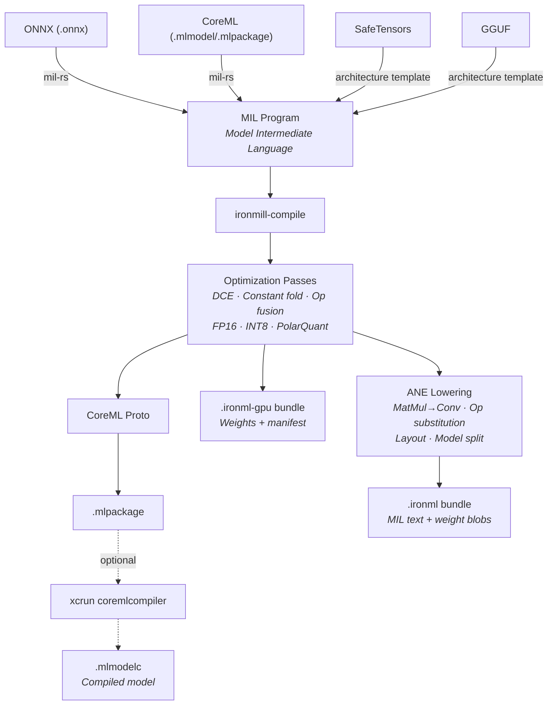
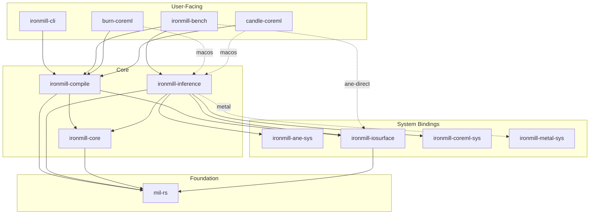

<div align="center">

# ⚙️ ironmill

[](https://github.com/jafreck/ironmill/actions)
[](LICENSE)
[](https://www.rust-lang.org)
[]()

Rust-native model compiler and inference runtime for Apple Silicon.

</div>

> [!WARNING]
> **ironmill is currently in alpha and under active development.** APIs, file
> formats, and CLI interfaces may change without notice. Not recommended for
> production use.

ironmill compiles ML models into optimized bundles and runs them on Apple
Silicon hardware. It supports multiple input formats (ONNX, SafeTensors,
GGUF, CoreML), applies optimization and quantization passes via an
intermediate representation ([MIL](https://apple.github.io/coremltools/docs-guides/source/mil-program.html)),
and produces artifacts for three inference backends: Metal (GPU/MPS), CoreML,
and an experimental direct-ANE backend built on reverse-engineered private APIs.

## Features

### Compiler

Imports models, applies optimization passes, and outputs backend-specific
bundles:

- **Model import:** ONNX, SafeTensors, GGUF, CoreML (.mlmodel/.mlpackage)
- **MIL IR:** full read/write/manipulation of Apple's Model Intermediate Language
- **General optimization:** dead code elimination, constant folding, op fusion
  (conv+batchnorm, conv+relu, linear+relu, SDPA)
- **Quantization:** FP16, INT8 weight-only, 2/4/6/8-bit weight quantization (PolarQuant)
- **ANE lowering:** matmul→conv1×1, layout optimization, op substitution,
  automatic model splitting into ANE-sized sub-programs
- **Output formats:**
  - `.mlpackage` for CoreML (with optional `xcrun coremlcompiler` compilation)
  - `.ironml` bundles for ANE Direct (MIL text + weight blobs)
  - `.ironml-gpu` bundles for Metal GPU

### Inference Runtime

Three backends for running compiled models, each targeting different
hardware:

| | Metal GPU | CoreML | ANE Direct |
|---|:---:|:---:|:---:|
| Autoregressive decode | ✅ | — | ✅ |
| Custom compute kernels | ✅ | — | ✅ |
| INT8 KV cache (TurboQuant) | ✅ | — | ✅ |
| Hardware scheduling | ironmill | Apple | ironmill |
| Backing tech | Metal / MPS | CoreML (CPU, GPU, ANE) | ANE private API |

#### Metal GPU

Primary backend for LLM inference on Apple Silicon GPUs:

- MPS matrix multiplication for linear layers
- Custom Metal kernels for RMSNorm, RoPE, SiLU, attention, and residuals
- TurboQuant INT8 KV cache with fused quantize/dequantize shaders
- Prefill and single-step decode modes

#### CoreML

Wraps Apple's CoreML runtime (`MLModel`). Loads compiled `.mlmodelc`
packages and delegates hardware scheduling (ANE/GPU/CPU) to Apple's
runtime. Supports model loading and prediction — no LLM-specific decode
loop or KV cache management.

#### ANE Direct *(experimental)*

Bypasses CoreML to talk directly to the Neural Engine using
reverse-engineered private APIs (`_ANECompiler`, `_ANEInMemoryModel`).
Loads pre-compiled `.ironml` bundles:

- IOSurface-backed tensor I/O for ANE-compatible memory layout
- [TurboQuant](docs/design/turboquant.md): INT8 KV cache compression with
  Hadamard rotation and on-ANE dequantization
- Autoregressive decode loop with ANE-accelerated lm_head via chunked conv1×1

## Usage

### CLI

```bash
cargo install --path crates/ironmill-cli
```

#### Commands

```
COMMANDS:
  compile           Compile a model to CoreML, ANE, or Metal format
  inspect           Print model structure and metadata
  validate          Validate model for target hardware compatibility
  compile-pipeline  Compile a multi-stage pipeline from a TOML manifest
  pipeline-report   Compare two pipeline configurations
```

#### `compile`

Convert an ONNX, SafeTensors, GGUF, or CoreML model to an optimized output format.

Key flags:

| Flag | Description |
|------|-------------|
| `-o, --output <PATH>` | Output path (default: derived from input) |
| `-t, --target <TARGET>` | Compute units: `all`, `cpu-only`, `cpu-and-gpu`, `cpu-and-ne`, `gpu` |
| `-q, --quantize <MODE>` | Quantization: `none`, `fp16`, `int8`, `mixed-fp16-int8`, `awq`, `int4`, `gptq`, `d2quant` |
| `--cal-data <DIR>` | Calibration data directory (for INT8, AWQ, or GPTQ) |
| `--polar-quantize <BITS>` | PolarQuant weight quantization (2 or 4 bit) |
| `--palettize <BITS>` | Weight palettization bit-width (2, 4, 6, or 8) |
| `--quip-sharp` | QuIP# (E8 lattice) 2-bit weight quantization |
| `--input-shape <NAME:SHAPE>` | Set concrete input shape for ANE (repeatable) |
| `--ane` | Emit ANE-optimized ops (1×1 conv projections, decomposed RMSNorm, etc.) |
| `--ane-memory-budget <SIZE>` | ANE memory budget per op (e.g. `1GB`, `512MB`) |
| `--runtime <BACKEND>` | Runtime backend: `coreml` (default), `ane-direct` (experimental) |
| `--kv-quant <MODE>` | KV cache quantization: `none`, `turbo-int8` |
| `--pipeline-config <PATH>` | TOML pipeline configuration (overrides default passes) |
| `--no-fusion` | Disable fusion and optimization passes |
| `--moe-split` | Split MoE model into per-expert `.mlpackage` files |
| `--moe-bundle` | Bundle MoE experts as functions in a single `.mlpackage` |
| `--split-draft-layers <N>` | Split model for speculative decoding (draft + verifier) |
| `--annotate-compute-units` | Annotate ops with preferred compute unit (ANE/GPU/CPU) |

#### `inspect`

Print model structure and metadata for `.onnx`, `.mlmodel`, or `.mlpackage` files.

#### `validate`

Check whether a model is compatible with the Apple Neural Engine.

| Flag | Description |
|------|-------------|
| `--format <FMT>` | Output format: `text` (default) or `json` |

#### `compile-pipeline`

Compile a multi-ONNX pipeline from a TOML manifest into coordinated `.mlpackage` outputs.

| Flag | Description |
|------|-------------|
| `-o, --output <DIR>` | Output directory for `.mlpackage` files and `pipeline.json` |

#### `pipeline-report`

Compare two pipeline configurations on a model and report metrics.

| Flag | Description |
|------|-------------|
| `--config-a <PATH>` | Path to the first pipeline config (TOML) |
| `--config-b <PATH>` | Path to the second pipeline config (TOML) |

#### Examples

```bash
# Basic CoreML conversion
ironmill compile model.onnx

# FP16 quantization with explicit output path
ironmill compile model.onnx -o output.mlpackage --quantize fp16

# Weight-only INT8 quantization
ironmill compile model.onnx --quantize int8

# Fixed input shapes for ANE compatibility
ironmill compile model.onnx --input-shape "input:1,3,224,224"

# 4-bit PolarQuant for Metal GPU backend
ironmill compile model.onnx --target gpu --polar-quantize 4

# ANE-optimized compile with TurboQuant KV cache
ironmill compile model.onnx --ane --kv-quant turbo-int8

# Compile a multi-stage pipeline
ironmill compile-pipeline pipeline.toml -o out/

# Compare two pipeline configs
ironmill pipeline-report model.onnx --config-a fast.toml --config-b accurate.toml

# Inspect model structure
ironmill inspect model.onnx

# Validate ANE compatibility (JSON output)
ironmill validate model.onnx --format json
```

### Rust API — Compilation

Compile an ONNX model to a CoreML package:

```rust
use ironmill_compile::coreml::CompileBuilder;

let output = CompileBuilder::new("model.onnx")
    .quantize(Quantization::Fp16)
    .compile()          // run xcrun coremlcompiler
    .build()?;

// output.mlpackage, output.mlmodelc
```

Compile for Metal GPU with PolarQuant weight quantization:

```rust
use ironmill_compile::gpu::GpuCompileBuilder;
use ironmill_compile::gpu::bundle::write_gpu_bundle;

let provider = GpuCompileBuilder::new("model.onnx")
    .polar_quantize(4)  // 4-bit PolarQuant
    .build()?;

write_gpu_bundle(&provider, "model.ironml-gpu")?;
```

### Rust API — Inference

**Metal GPU** — load a compiled bundle and run autoregressive decoding:

```rust
use ironmill_inference::gpu::{GpuConfig, GpuInference};
use ironmill_inference::gpu::bundle::GpuBundleProvider;
use ironmill_inference::InferenceEngine;

let provider = GpuBundleProvider::open("model.ironml-gpu")?;
let config = GpuConfig::default();

let mut engine = GpuInference::new(config.clone())?;
engine.load_weights(&provider, config)?;

let logits = engine.prefill(&[1, 2, 3])?;          // prompt
let next_logits = engine.decode_step(token_id)?;    // autoregressive
```

**CoreML** — load a compiled model and run prediction:

```rust
use ironmill_inference::coreml_runtime::{ComputeUnits, Model, PredictionInput};

let model = Model::load("Model.mlmodelc".as_ref(), ComputeUnits::All)?;

let mut input = PredictionInput::new();
input.add_multi_array("input", &[1, 3, 224, 224], dtype, &data)?;

let output = model.predict(&input)?;
```

**ANE Direct** — load a bundle and generate tokens:

```rust
use std::sync::Arc;
use ironmill_inference::ane::decode::AneInference;
use ironmill_inference::ane::HardwareAneDevice;

let device = Arc::new(HardwareAneDevice::new()?);
let mut model = AneInference::from_bundle(device, "model.ironml".as_ref(), None)?;

let tokens = model.generate(&[1, 2, 3], 128, 0.8)?;
```

### C API & Framework Bridges

- **C API:** stable C ABI for Swift, C++, Go, or any FFI language ([docs](docs/C_API.md))
- **[candle-coreml](crates/candle-coreml/):** ONNX→CoreML conversion + runtime for [candle](https://github.com/huggingface/candle)
- **[burn-coreml](crates/burn-coreml/):** export + inference bridge for [Burn](https://github.com/tracel-ai/burn)

## Architecture

### Compilation Pipeline



### Crate Structure



| Crate | Description |
|-------|-------------|
| [`mil-rs`](crates/mil-rs/) | MIL IR library: read/write CoreML models, ONNX conversion, proto↔IR, pass pipeline |
| [`ironmill-core`](crates/ironmill-core/) | Shared types: bundle schemas, weight traits, model configs, MIL text emitter |
| [`ironmill-compile`](crates/ironmill-compile/) | Compiler: optimization passes, CoreML/ANE/GPU build APIs, weight providers |
| [`ironmill-inference`](crates/ironmill-inference/) | Inference: Metal GPU, CoreML, and ANE Direct backends |
| [`ironmill-ane-sys`](crates/ironmill-ane-sys/) | FFI bindings for ANE private APIs (macOS) |
| [`ironmill-iosurface`](crates/ironmill-iosurface/) | IOSurface tensor management for ANE I/O (macOS) |
| [`ironmill-coreml-sys`](crates/ironmill-coreml-sys/) | CoreML runtime bindings via objc2 (macOS) |
| [`ironmill-metal-sys`](crates/ironmill-metal-sys/) | Metal and MPS framework bindings (macOS) |
| [`ironmill-cli`](crates/ironmill-cli/) | CLI: `compile`, `inspect`, `validate`, `compile-pipeline`, `pipeline-report` |
| [`ironmill-bench`](crates/ironmill-bench/) | Benchmarks: latency, power, perplexity |
| [`candle-coreml`](crates/candle-coreml/) | [candle](https://github.com/huggingface/candle) bridge: ONNX→CoreML + runtime |
| [`burn-coreml`](crates/burn-coreml/) | [Burn](https://github.com/tracel-ai/burn) bridge: export + inference |

## ANE Research & Related Projects

Building on [prior art](#ane-related-projects) in ANE reverse-engineering, ironmill
contributes reproducible eval-verified tests for MIL ops on Apple's Neural
Engine:

- **38 newly verified ops** (33 eval-verified, 5 compile-verified) not
  confirmed by any other open-source project
- **The epsilon discovery:** `rsqrt`, `log`, and `inverse` require an
  undocumented `epsilon` parameter; without it the compiler silently rejects
  them. Previously believed hardware-unsupported.
- **`layer_norm` on ANE:** other projects perform normalization on CPU
- **`erf` on ANE:** enables on-ANE GELU without tanh decomposition
- **Full INT8 pipeline:** `quantize`/`dequantize`/`cast` verified for
  end-to-end INT8 KV cache on ANE
- **Comparison + conditional ops:** all 6 comparison ops plus
  `select`/`logical_not` verified, enabling conditional logic on ANE

Every finding has a reproducible eval test in
[`ane_op_eval.rs`](crates/ironmill-inference/examples/ane_op_eval.rs).
See the full [ANE Op Support Matrix](docs/design/ane-op-support-matrix.md).

### ANE Related Projects

Open-source projects working with the ANE via private APIs:

- [maderix/ANE](https://github.com/maderix/ANE): ANE reverse-engineering, hardware characterization, transformer training proof-of-concept
- [mechramc/Orion](https://github.com/mechramc/Orion): ANE LLM training and inference runtime with graph IR compiler ([paper](https://arxiv.org/abs/2603.06728))
- [vipuldivyanshu92/ANEgpt](https://github.com/vipuldivyanshu92/ANEgpt): GPT-style transformer training on ANE
- [hollance/neural-engine](https://github.com/hollance/neural-engine): Community documentation of ANE capabilities

## Rust ML Ecosystem

ironmill sits alongside a growing ecosystem of Rust-native ML frameworks.
The candle and Burn bridge crates let you use ironmill's Metal GPU/CoreML
backends from models built in those frameworks.

| Project | Focus |
|---------|-------|
| [candle](https://github.com/huggingface/candle) | Lightweight ML framework with GPU support (candle-coreml bridge in this repo) |
| [Burn](https://github.com/tracel-ai/burn) | Modular deep learning framework with multiple backends (burn-coreml bridge in this repo) |
| [tract](https://github.com/sonos/tract) | ONNX/NNEF inference engine for edge deployment |
| [ort](https://github.com/pykeio/ort) | Rust bindings for ONNX Runtime |
| [tch-rs](https://github.com/LaurentMazare/tch-rs) | Rust bindings for the PyTorch C++ API (libtorch) |
| [dfdx](https://github.com/coreylowman/dfdx) | Compile-time typed deep learning framework |
| [luminal](https://github.com/jafioti/luminal) | Graph-based ML framework with Metal support |

## Building from Source

```bash
git clone https://github.com/jafreck/ironmill.git
cd ironmill
cargo build --workspace
cargo test --workspace
```

Requires Rust 1.85+ (edition 2024).

## Documentation

- [C API](docs/C_API.md): building, linking, and calling from C/Swift/C++
- [ANE Op Support Matrix](docs/design/ane-op-support-matrix.md): verified ANE ops with eval tests
- [ANE Inference](docs/design/ane-inference.md): inference pipeline architecture
- [ANE Constraints](docs/design/ane-constraints.md): hardware limits and diagnostics
- [TurboQuant](docs/design/turboquant.md): INT8 KV cache compression design
- [Compact Cache](docs/design/compact-cache.md): cache memory optimization

## License

Licensed under the Apache License, Version 2.0 ([LICENSE](LICENSE) or <http://www.apache.org/licenses/LICENSE-2.0>).
