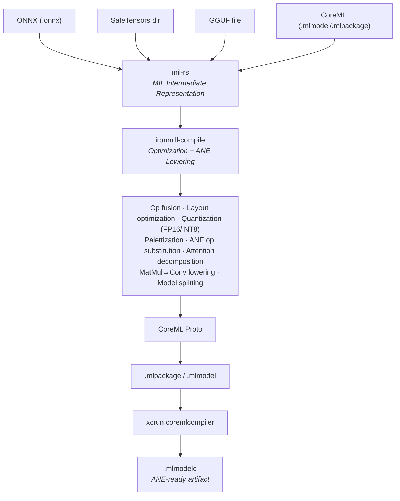
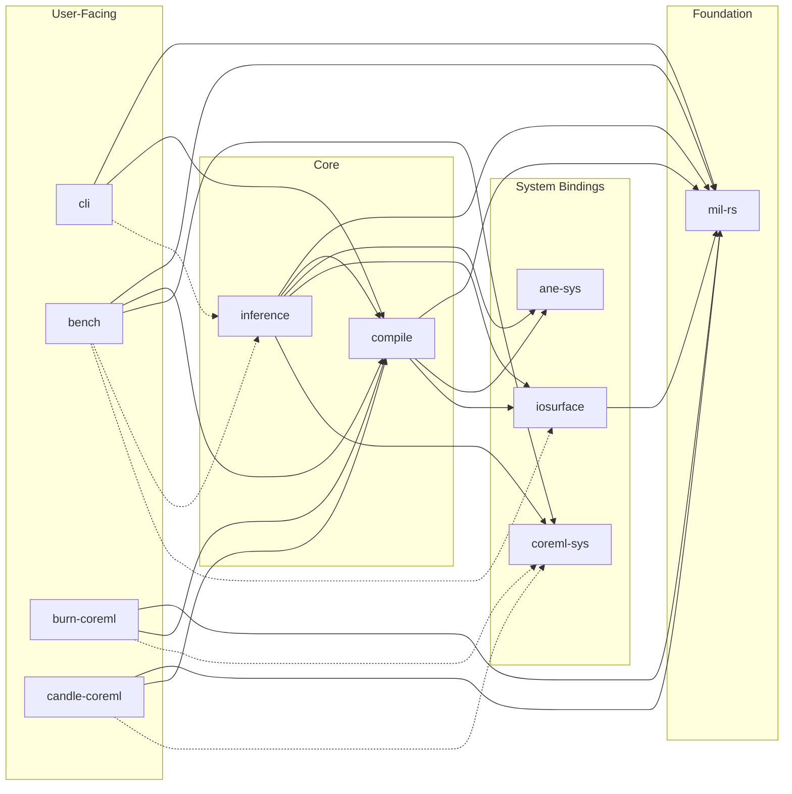

<div align="center">

# ⚙️ ironmill

[](https://github.com/jafreck/ironmill/actions)
[](LICENSE)
[](https://www.rust-lang.org)
[]()

Rust-native compiler and inference runtime for Apple's Neural Engine — no Python required.

</div>

ironmill converts models from ONNX, SafeTensors, and GGUF into optimized
CoreML packages, and can run them directly on the ANE via either CoreML or
experimental direct ANE APIs.

## Quick Start

```bash
# Install from source
cargo install --path crates/ironmill-cli

# Convert an ONNX model to CoreML
ironmill compile model.onnx

# Convert with FP16 quantization and fixed input shapes
ironmill compile model.onnx --quantize fp16 --input-shape "input:1,3,224,224"

# Inspect any model format
ironmill inspect model.onnx
ironmill inspect model.mlpackage

# Check ANE compatibility
ironmill validate model.onnx
```

## Features

### Compiler

ironmill-compile lowers models through a pipeline of optimization passes
targeting Apple's Neural Engine:

- **Model import** — ONNX, SafeTensors, GGUF, CoreML (.mlmodel/.mlpackage)
- **MIL IR** — full read/write/manipulation of Apple's Model Intermediate Language
- **Optimization passes** — dead code elimination, constant folding, identity removal
- **Op fusion** — conv+batchnorm, conv+relu, linear+relu, scaled dot-product attention
- **ANE lowering** — matmul→conv1×1, layout optimization, op substitution, shape materialization
- **Quantization** — FP16, INT8 weight-only (with optional calibration data)
- **Weight palettization** — 2/4/6/8-bit k-means compression
- **Model splitting** — automatic partitioning into ANE-sized sub-programs
- **CoreML output** — .mlpackage/.mlmodel with optional `xcrun coremlcompiler` compilation

### Inference Runtime

ironmill-inference provides two backends for running compiled models:

**CoreML backend** — standard CoreML runtime via `MLModel`. Works with any
.mlmodelc compiled package. Apple manages ANE/GPU/CPU scheduling.

**ANE-direct backend** *(experimental)* — bypasses CoreML entirely using
reverse-engineered private APIs (`_ANEInMemoryModel`, `_ANECompiler`). Gives
fine-grained control over:

- Sub-program loading/unloading with compile/load lifecycle separation
- IOSurface-backed zero-copy tensor I/O
- [TurboQuant](docs/design/turboquant.md) — INT8 KV cache compression with
  Hadamard rotation and on-ANE dequantization
- Autoregressive decode loop with ANE-accelerated lm_head via chunked conv1×1

### Ecosystem Integration

- **CLI** — `ironmill compile`, `inspect`, `validate`
- **C API** — stable C ABI for Swift, C++, Go, or any FFI language ([docs](docs/C_API.md))
- **Build.rs API** — compile models at build time with `CompileBuilder`
- **[candle-coreml](crates/candle-coreml/)** — ONNX→CoreML conversion + runtime for candle
- **[burn-coreml](crates/burn-coreml/)** — export + inference bridge for Burn

## ANE Research Findings

ironmill includes the most comprehensive open-source verification of MIL ops
on Apple's Neural Engine. Building on [prior art](#related-projects), the
project contributes:

- **38 newly verified ops** (33 eval-verified, 5 compile-verified) not
  confirmed by any other open-source project
- **The epsilon discovery** — `rsqrt`, `log`, and `inverse` require an
  undocumented `epsilon` parameter; without it the compiler silently rejects
  them. Previously believed hardware-unsupported.
- **`layer_norm` on ANE** — all other projects perform normalization on CPU
- **`erf` on ANE** — enables on-ANE GELU without tanh decomposition
- **Full INT8 pipeline** — `quantize`/`dequantize`/`cast` verified for
  end-to-end INT8 KV cache on ANE
- **Comparison + conditional ops** — all 6 comparison ops plus
  `select`/`logical_not` verified, enabling conditional logic on ANE

Every finding has a reproducible eval test in
[`ane_op_eval.rs`](crates/ironmill-inference/examples/ane_op_eval.rs).
See the full [ANE Op Support Matrix](docs/design/ane-op-support-matrix.md).

## Architecture

### Compilation Pipeline



### Crate Structure



| Crate | Description |
|-------|-------------|
| [`mil-rs`](crates/mil-rs/) | Core MIL IR library — read/write CoreML models, ONNX conversion, proto↔IR, pass pipeline |
| [`ironmill-compile`](crates/ironmill-compile/) | Compilation pipeline — ANE lowering passes, CoreML build API, templates, weight providers |
| [`ironmill-inference`](crates/ironmill-inference/) | Inference engine — ANE-direct and CoreML backends, decode loop, TurboQuant, sampling |
| [`ironmill-ane-sys`](crates/ironmill-ane-sys/) | Safe FFI bindings for Apple Neural Engine private APIs (macOS-only) |
| [`ironmill-iosurface`](crates/ironmill-iosurface/) | IOSurface tensor management for ANE I/O (macOS-only) |
| [`ironmill-coreml-sys`](crates/ironmill-coreml-sys/) | CoreML runtime bindings via objc2 (macOS-only) |
| [`ironmill-cli`](crates/ironmill-cli/) | CLI — `compile`, `inspect`, `validate` commands |
| [`ironmill-bench`](crates/ironmill-bench/) | Inference benchmark harness — power, quality, perplexity metrics |
| [`candle-coreml`](crates/candle-coreml/) | Bridge crate — ONNX→CoreML conversion + runtime for candle |
| [`burn-coreml`](crates/burn-coreml/) | Bridge crate — ONNX→CoreML export + runtime for Burn |

## CLI Usage

### `ironmill compile`

```bash
ironmill compile model.onnx                                        # basic conversion
ironmill compile model.onnx -o output.mlpackage --quantize fp16    # FP16 quantization
ironmill compile model.onnx --quantize int8                        # weight-only INT8
ironmill compile model.onnx --quantize int8 --cal-data imgs/       # INT8 with calibration
ironmill compile model.onnx --palettize 4                          # 4-bit palettization
ironmill compile model.onnx --input-shape "input:1,3,224,224"      # fixed shapes for ANE
ironmill compile model.onnx --no-fusion                            # skip optimization passes
```

### `ironmill inspect`

```bash
ironmill inspect model.onnx
ironmill inspect model.mlmodel
ironmill inspect model.mlpackage
```

### `ironmill validate`

```bash
ironmill validate model.onnx
```

## Building from Source

```bash
git clone https://github.com/jafreck/ironmill.git
cd ironmill
cargo build --workspace
cargo test --workspace
```

Requires Rust 1.85+ (edition 2024).

## Documentation

- [C API](docs/C_API.md) — building, linking, and calling from C/Swift/C++
- [ANE Op Support Matrix](docs/design/ane-op-support-matrix.md) — verified ANE ops with eval tests
- [ANE Inference](docs/design/ane-inference.md) — inference pipeline architecture
- [ANE Constraints](docs/design/ane-constraints.md) — hardware limits and diagnostics
- [TurboQuant](docs/design/turboquant.md) — INT8 KV cache compression design
- [Compact Cache](docs/design/compact-cache.md) — cache memory optimization

## Related Projects

Open-source projects working with the ANE via private APIs:

- [maderix/ANE](https://github.com/maderix/ANE) — ANE reverse-engineering, hardware characterization, transformer training proof-of-concept
- [mechramc/Orion](https://github.com/mechramc/Orion) — ANE LLM training & inference runtime with graph IR compiler ([paper](https://arxiv.org/abs/2603.06728))
- [vipuldivyanshu92/ANEgpt](https://github.com/vipuldivyanshu92/ANEgpt) — GPT-style transformer training on ANE
- [hollance/neural-engine](https://github.com/hollance/neural-engine) — Community documentation of ANE capabilities

## License

Licensed under the Apache License, Version 2.0 ([LICENSE](LICENSE) or <http://www.apache.org/licenses/LICENSE-2.0>).
