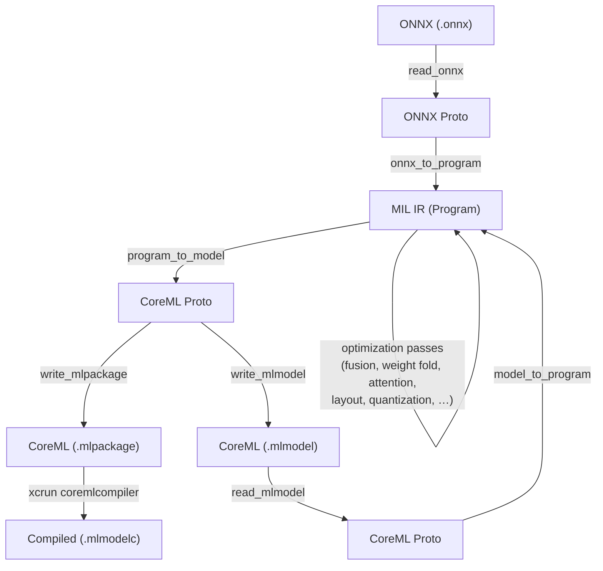

# coreml-kit

Rust-native tools for converting, optimizing, and inspecting Apple CoreML
models — no Python required.

## Quick start

```bash
# Install from source
cargo install --path crates/coreml-kit-cli

# Convert an ONNX model to CoreML
coreml-kit compile model.onnx

# Convert with FP16 quantization and fixed input shapes
coreml-kit compile model.onnx --quantize fp16 --input-shape "input:1,3,224,224"

# Inspect any model format
coreml-kit inspect model.onnx
coreml-kit inspect model.mlmodel
coreml-kit inspect model.mlpackage

# Check ANE compatibility
coreml-kit validate model.onnx
```

## Features

| Feature | Status |
|---------|--------|
| Read/write `.mlmodel` files | ✅ |
| Read/write `.mlpackage` directories | ✅ |
| MIL IR (Program, Function, Block, Operation) | ✅ |
| Proto ↔ IR bidirectional conversion | ✅ |
| ONNX → CoreML conversion (common ops) | ✅ |
| Optimization passes (dead code, identity, constant fold) | ✅ |
| Op fusion (conv+bn, conv+relu, linear+relu) | ✅ |
| Conv+BatchNorm weight folding | ✅ |
| Attention pattern fusion (scaled dot-product) | ✅ |
| Op substitution for ANE compatibility (GELU expansion) | ✅ |
| Memory layout optimization (NCHW → NHWC) | ✅ |
| FP16 quantization | ✅ |
| INT8 post-training quantization (weight-only) | ✅ |
| Weight palettization (2/4/6/8-bit k-means) | ✅ |
| Pass pipeline manager with mutual exclusivity checks | ✅ |
| Shape materialization for ANE | ✅ |
| ANE compatibility validator | ✅ |
| `xcrun coremlcompiler` integration | ✅ |
| CLI (`compile`, `inspect`, `validate`) | ✅ |
| `candle` / `burn` integration | planned |

## Architecture

The project is a Cargo workspace with two crates:

| Crate | Description |
|-------|-------------|
| [`mil-rs`](crates/mil-rs/) | Core library — read/write CoreML models, MIL IR, ONNX conversion, optimization passes, ANE validation |
| [`coreml-kit-cli`](crates/coreml-kit-cli/) | CLI tool wrapping `mil-rs` — `compile`, `inspect`, and `validate` commands |

### How conversion works



## Using `mil-rs` as a library

See the [`mil-rs` README](crates/mil-rs/README.md) for detailed API docs and
examples.

```rust,no_run
use mil_rs::{read_onnx, onnx_to_program, program_to_model, write_mlpackage};

let onnx = read_onnx("model.onnx").unwrap();
let result = onnx_to_program(&onnx).unwrap();
let model = program_to_model(&result.program, 7).unwrap();
write_mlpackage(&model, "model.mlpackage").unwrap();
```

## CLI usage

### `coreml-kit compile`

Convert an ONNX model to a CoreML `.mlpackage`. Automatically runs
optimization passes and optionally quantizes or compresses weights.

```bash
coreml-kit compile model.onnx
coreml-kit compile model.onnx -o output.mlpackage --quantize fp16
coreml-kit compile model.onnx --quantize int8                        # weight-only INT8
coreml-kit compile model.onnx --quantize int8 --cal-data imgs/       # INT8 with calibration
coreml-kit compile model.onnx --palettize 4                          # 4-bit weight palettization
coreml-kit compile model.onnx --quantize fp16 --palettize 6          # FP16 + 6-bit palettes
coreml-kit compile model.onnx --input-shape "input:1,3,224,224"
coreml-kit compile model.onnx --no-fusion                            # disable optimization passes
```

If `xcrun coremlcompiler` is available (macOS with Xcode), the output is also
compiled to `.mlmodelc`.

### `coreml-kit inspect`

Print a summary of any model's structure:

```bash
coreml-kit inspect model.onnx
coreml-kit inspect model.mlmodel
coreml-kit inspect model.mlpackage
```

### `coreml-kit validate`

Check whether a model's operations are compatible with Apple's Neural Engine:

```bash
coreml-kit validate model.onnx
```

## Building from source

```bash
git clone https://github.com/jfreck/coreml-kit.git
cd coreml-kit

# Build everything
cargo build --workspace

# Run all tests
cargo test --workspace

# Build documentation
cargo doc --no-deps --workspace --open
```

Requires Rust 1.85+ (edition 2024).

## Documentation

- [API docs](https://docs.rs/mil-rs) — generated from rustdoc
- [`docs/research/`](docs/research/) — background research:
  - [ANE Gap Analysis](docs/research/ane-research.md)
  - [Competitive Analysis](docs/research/competitive-analysis.md)
  - [Integration Strategy](docs/research/integration-strategy.md)

## License

Licensed under either of:

- Apache License, Version 2.0 ([LICENSE-APACHE](LICENSE-APACHE) or <http://www.apache.org/licenses/LICENSE-2.0>)
- MIT License ([LICENSE-MIT](LICENSE-MIT) or <http://opensource.org/licenses/MIT>)

at your option.
