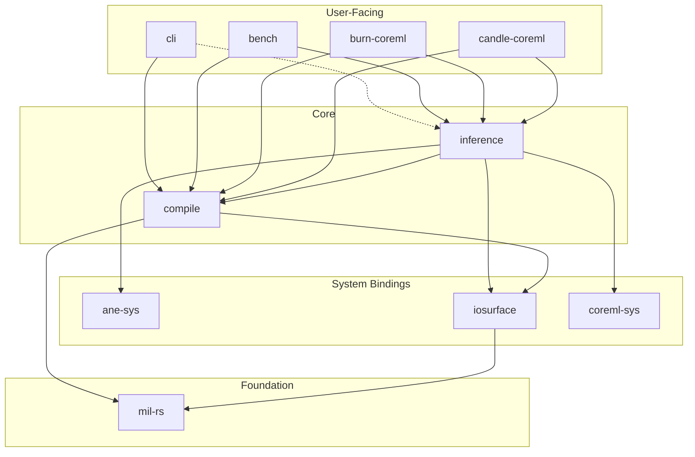

# Crate Dependency Cleanup — COMPLETED

User-facing crates reach around the core layer (`ironmill-compile`,
`ironmill-inference`) to depend directly on low-level crates (`mil-rs`,
`ironmill-coreml-sys`, `ironmill-iosurface`). This document catalogs every
violation, explains what each crate actually uses, and proposes re-exports that
restore proper layering.

## Current state

The README's dependency graph shows the problem:

```
  User-Facing          Core               System / Foundation
  ───────────          ────               ───────────────────
  cli ──────────────── mil-rs             ← reach-around
  cli ──────────────── compile            ✓
  bench ─────────────── mil-rs            ← reach-around
  bench ─────────────── coreml-sys        ← reach-around
  bench ─────────────── iosurface         ← reach-around (declared, unused in src/)
  bench ─────────────── compile           ✓
  burn-coreml ────────── coreml-sys       ← reach-around
  burn-coreml ────────── mil-rs           ← stale (declared, unused in src/)
  burn-coreml ────────── compile          ✓
  candle-coreml ──────── coreml-sys       ← reach-around
  candle-coreml ──────── mil-rs           ← stale (declared, unused in src/)
  candle-coreml ──────── compile          ✓
```

Additionally, `ironmill-compile` declares `ironmill-ane-sys` as a dependency
but never references it in `src/`.

## Violations by crate

### 1. ironmill-cli → mil-rs

The CLI uses mil-rs directly for model I/O, ONNX conversion, the pass pipeline,
MoE utilities, and reader/summary functions.

```rust
// main.rs
use mil_rs::ir::PassPipeline;
use mil_rs::ir::PipelineReport;
use mil_rs::reader::{print_model_summary, print_onnx_summary};
use mil_rs::{
    ConversionConfig, LossFunction, UpdatableModelConfig, UpdateOptimizer,
    onnx_to_program_with_config, program_to_model,
    program_to_multi_function_model, program_to_updatable_model,
    read_mlmodel, read_mlpackage, read_onnx, write_mlpackage,
};
use mil_rs::convert::moe::{detect_moe, split_moe, ExpertFrequencyProfile, fuse_top_k_experts};
use mil_rs::model_to_program;
// also: mil_rs::ir::Program in count_ops()
```

**Fix:** Re-export these through `ironmill-compile`. The compile crate already
re-exports `mil_rs::convert::moe::*` and `mil_rs::convert::lora::*` from
submodules — this pattern just needs to be extended to the top-level conversion
API, reader, pass pipeline, and IR types.

### 2. ironmill-bench → mil-rs

The bench harness does model conversion and pass manipulation:

```rust
// quality.rs
use mil_rs::ir::passes::PolarQuantPass;
use mil_rs::ir::passes::tensor_utils::tensor_as_f32_slice;
use mil_rs::{Pass, Program, ScalarType, Value};
```

**Fix:** Same as CLI — once `ironmill-compile` re-exports these, bench uses
them from compile.

### 3. ironmill-bench → ironmill-coreml-sys

Bench uses CoreML runtime bindings directly for model loading and prediction:

```rust
// inference.rs
use ironmill_coreml_sys::{ComputeUnits, Model, build_dummy_input};
```

**Fix:** Re-export through `ironmill-inference` (see §3 below).

### 4. burn-coreml → ironmill-coreml-sys

The Burn bridge crate wraps CoreML runtime types for inference:

```rust
// inference.rs
use ironmill_coreml_sys::{ComputeUnits, Model, MultiArrayDataType, PredictionInput};
```

**Fix:** Re-export through `ironmill-inference`.

### 5. candle-coreml → ironmill-coreml-sys

Same pattern as burn-coreml:

```rust
// runtime.rs
pub use ironmill_coreml_sys::ComputeUnits;
use ironmill_coreml_sys::{Model, MultiArrayDataType, PredictionInput};
```

**Fix:** Re-export through `ironmill-inference`.

### 6. Stale / unused dependencies

| Crate | Stale dep | Evidence |
|---|---|---|
| `ironmill-compile` | `ironmill-ane-sys` | No references in `src/` |
| `burn-coreml` | `mil-rs` | No references in `src/` |
| `candle-coreml` | `mil-rs` | No references in `src/` |
| `ironmill-bench` | `ironmill-iosurface` | No references in `src/` |

## Proposed changes

### 1. ironmill-compile: re-export mil-rs public API

Add a top-level re-export module so user-facing crates get mil-rs types through
compile:

```rust
// crates/ironmill-compile/src/lib.rs

/// Re-exports from mil-rs for downstream consumers.
///
/// User-facing crates should depend on ironmill-compile, not mil-rs directly.
pub mod mil {
    // Core IR types
    pub use mil_rs::ir::{Program, PassPipeline, PipelineReport, Operation};
    pub use mil_rs::{ScalarType, Value, Pass};

    // Model I/O
    pub use mil_rs::{
        read_mlmodel, read_mlpackage, read_onnx,
        write_mlpackage, model_to_program,
        program_to_model, program_to_multi_function_model,
        program_to_updatable_model,
    };

    // Conversion
    pub use mil_rs::{
        ConversionConfig, onnx_to_program_with_config,
        LossFunction, UpdatableModelConfig, UpdateOptimizer,
    };

    // Reader / inspection
    pub use mil_rs::reader::{print_model_summary, print_onnx_summary};

    // Passes
    pub mod passes {
        pub use mil_rs::ir::passes::PolarQuantPass;
        pub use mil_rs::ir::passes::tensor_utils;
    }
}
```

Then the CLI changes from `use mil_rs::read_onnx` to
`use ironmill_compile::mil::read_onnx`.

### 2. ironmill-inference: re-export CoreML runtime types

Add a re-export so burn-coreml, candle-coreml, and bench get runtime types
through inference:

```rust
// crates/ironmill-inference/src/lib.rs

/// CoreML runtime types re-exported for downstream consumers.
///
/// User-facing crates should depend on ironmill-inference, not
/// ironmill-coreml-sys directly.
pub mod coreml_runtime {
    pub use ironmill_coreml_sys::{
        ComputeUnits, Model, MultiArrayDataType,
        PredictionInput, PredictionOutput,
        build_dummy_input,
    };
}
```

Then burn-coreml changes from `use ironmill_coreml_sys::Model` to
`use ironmill_inference::coreml_runtime::Model`.

### 3. Remove stale dependencies

```toml
# crates/ironmill-compile/Cargo.toml  — remove:
ironmill-ane-sys = { workspace = true }

# crates/burn-coreml/Cargo.toml  — remove:
mil-rs = { workspace = true }

# crates/candle-coreml/Cargo.toml  — remove:
mil-rs = { workspace = true }

# crates/ironmill-bench/Cargo.toml  — remove:
ironmill-iosurface = { workspace = true }  # (optional dep, unused)
```

### 4. Update user-facing crate Cargo.tomls

After the re-exports are in place:

- **ironmill-cli**: remove `mil-rs` dep, keep `ironmill-compile`
- **ironmill-bench**: remove `mil-rs` and `ironmill-coreml-sys` deps, ensure
  both `ironmill-compile` and `ironmill-inference` are present
- **burn-coreml**: remove `ironmill-coreml-sys` dep, add `ironmill-inference`
- **candle-coreml**: remove `ironmill-coreml-sys` dep, add `ironmill-inference`

### 5. Update README crate diagram

After cleanup the diagram should show clean layering:



## Open question: ironmill-compile → ironmill-iosurface

`ironmill-compile` uses `ironmill-iosurface` in `src/ane/packing.rs` for
`AneTensor` (spatial packing of weight data) and in `src/ane/mod.rs` for
`IOSurfaceError` conversion. This is for assembling ANE artifacts at compile
time, not runtime tensor I/O — so it arguably belongs in the compile crate.
Leaving this as-is for now; revisit if the packing code moves to inference.

## Execution order

1. Add re-exports in `ironmill-compile` and `ironmill-inference`
2. Update imports in each user-facing crate (one crate at a time)
3. Remove stale deps from Cargo.tomls
4. `cargo check --workspace` after each crate to catch breakage
5. Update README diagram
