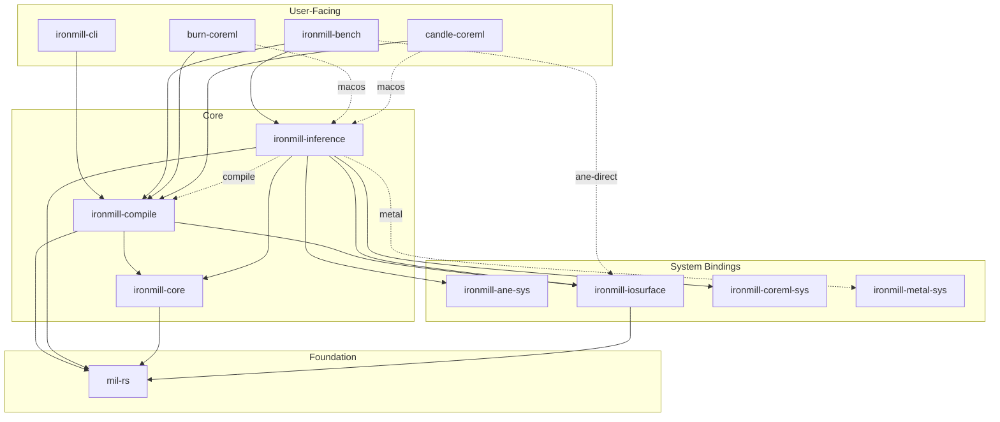

# Spec: Create `ironmill-core` crate and fix dependency layering

## Problem

`ironmill-inference` has an optional dependency on `ironmill-compile` (behind the `compile` feature flag). This exists because both crates share types: bundle manifest schemas, tensor descriptors, weight provider traits, and serialization helpers. The `compile` feature is required even just to *read* GPU bundles, which is wrong — reading pre-compiled artifacts shouldn't require the compilation crate.

## Approach

Create a new `ironmill-core` crate to hold shared types that both `ironmill-compile` and `ironmill-inference` need. Move pure data schemas, configs, and traits there. Add re-exports in the source crates for backward compatibility. Remove the `ironmill-compile` dependency from `ironmill-inference` code paths that only need shared types.

The worktree for this work is at `/Users/jacobfreck/Source/ironmill-core-refactor`.

## Verification

After all tasks are complete, run:
```
cd /Users/jacobfreck/Source/ironmill-core-refactor && cargo check --workspace --all-features && cargo test --workspace
```

---

## Task 1: Create `ironmill-core` crate scaffold

Create a new crate at `crates/ironmill-core/` with the following structure:

**`crates/ironmill-core/Cargo.toml`:**
```toml
[package]
name = "ironmill-core"
description = "Shared types for the ironmill workspace — bundle schemas, weight provider traits, and model configs"
version.workspace = true
edition.workspace = true
license.workspace = true
repository.workspace = true
rust-version.workspace = true

[dependencies]
mil-rs = { workspace = true }
serde = { workspace = true }
serde_json = { workspace = true }
thiserror = { workspace = true }
half = { workspace = true }
```

**`crates/ironmill-core/src/lib.rs`:**
```rust
//! Shared types for the ironmill workspace.
//!
//! This crate provides bundle manifest schemas, weight provider traits,
//! and model configuration types used by both `ironmill-compile` and
//! `ironmill-inference`.

pub mod ane;
pub mod gpu;
pub mod weights;
```

Add `ironmill-core` to the workspace in the root `Cargo.toml`:
- Add `"crates/ironmill-core"` to the `members` array
- Add `ironmill-core = { path = "crates/ironmill-core", version = "0.1.0" }` to `[workspace.dependencies]`

Create empty module files:
- `crates/ironmill-core/src/ane/mod.rs` with `pub mod bundle;` and `pub mod packing;`
- `crates/ironmill-core/src/ane/bundle.rs` (empty for now)
- `crates/ironmill-core/src/ane/packing.rs` (empty for now)
- `crates/ironmill-core/src/gpu/mod.rs` with `pub mod bundle;`
- `crates/ironmill-core/src/gpu/bundle.rs` (empty for now)
- `crates/ironmill-core/src/weights.rs` (empty for now)

---

## Task 2: Move weight types from `mil-rs` to `ironmill-core`

Move the contents of `crates/mil-rs/src/weights.rs` into `crates/ironmill-core/src/weights.rs`. The types to move are:

- `Architecture` enum (with its `FromStr` impl and `KNOWN` const)
- `ModelConfig` struct
- `QuantizationInfo` enum
- `WeightTensor<'a>` struct (with its methods)
- `WeightProvider` trait

These types currently depend on:
- `mil_rs::ir::ScalarType` — import as `mil_rs::ir::ScalarType`
- `mil_rs::MilError` — import as `mil_rs::MilError`
- `std::borrow::Cow`
- `half::f16`
- `serde_json::Value`

In `crates/ironmill-core/src/weights.rs`, add the necessary imports:
```rust
use std::borrow::Cow;
use half::f16;
use mil_rs::ir::ScalarType;
use mil_rs::MilError;
```

After moving, replace `crates/mil-rs/src/weights.rs` with re-exports for backward compatibility:
```rust
//! Weight provider types.
//!
//! These types have moved to `ironmill_core::weights`. This module
//! re-exports them for backward compatibility.

pub use ironmill_core::weights::*;
```

Update `crates/mil-rs/Cargo.toml` to add `ironmill-core` as a dependency:
```toml
ironmill-core = { workspace = true }
```

**IMPORTANT**: `mil-rs` depends on `ironmill-core`, and `ironmill-core` depends on `mil-rs`. This is a circular dependency. To break it:
- `ironmill-core::weights` depends on `mil_rs::ir::ScalarType` and `mil_rs::MilError`
- `mil-rs::weights` re-exports from `ironmill-core`

This won't work as a circular dep. Instead, **do NOT add re-exports in mil-rs**. Instead:
1. Move the types to `ironmill-core::weights`
2. In `crates/mil-rs/src/weights.rs`, keep the original types in place (don't move them)
3. In `ironmill-core::weights`, re-export from `mil-rs` instead:

```rust
//! Weight provider types, re-exported from mil-rs.
pub use mil_rs::weights::{Architecture, ModelConfig, QuantizationInfo, WeightProvider, WeightTensor};
```

This way `ironmill-core` depends on `mil-rs` (no cycle), and consumers can import from either.

---

## Task 3: Move ANE bundle manifest types to `ironmill-core`

Move these serde schema types from `crates/ironmill-compile/src/ane/bundle.rs` into `crates/ironmill-core/src/ane/bundle.rs`:

**Types to move** (these are pure data with `#[derive(Serialize, Deserialize)]`):
- `BundleArchitecture`
- `BundleTensorDescriptor`
- `BundleInputPacking`
- `BundleManifest`
- `BundleModelType`
- `SubProgramManifest`
- `DecodeManifest`
- `LmHeadManifest`
- `LayerManifest`

Also move `TensorDescriptor` (from `crates/ironmill-compile/src/ane/mod.rs`) into `crates/ironmill-core/src/ane/mod.rs`:
```rust
use mil_rs::ir::ScalarType;

#[derive(Debug, Clone, PartialEq)]
pub struct TensorDescriptor {
    pub name: String,
    pub shape: [usize; 4],
    pub dtype: ScalarType,
}
```

In the original `crates/ironmill-compile/src/ane/bundle.rs`, replace the moved types with re-exports:
```rust
pub use ironmill_core::ane::bundle::{
    BundleArchitecture, BundleInputPacking, BundleManifest, BundleModelType,
    BundleTensorDescriptor, DecodeManifest, LayerManifest, LmHeadManifest,
    SubProgramManifest,
};
```

In `crates/ironmill-compile/src/ane/mod.rs`, replace `TensorDescriptor` with a re-export:
```rust
pub use ironmill_core::ane::TensorDescriptor;
```

Add `ironmill-core` as a dependency in `crates/ironmill-compile/Cargo.toml`:
```toml
ironmill-core = { workspace = true }
```

The `crates/ironmill-core/src/ane/bundle.rs` file needs these imports:
```rust
use serde::{Deserialize, Serialize};
```

Copy each struct/enum definition exactly as-is from the compile crate, preserving all derives and serde attributes.

---

## Task 4: Move ANE `InputPacking` to `ironmill-core`

Move `InputPacking` from `crates/ironmill-compile/src/ane/packing.rs` into `crates/ironmill-core/src/ane/packing.rs`.

`InputPacking` is:
```rust
#[derive(Debug, Clone)]
pub struct InputPacking {
    pub offsets: Vec<usize>,
    pub sizes: Vec<usize>,
}
```

It has no external dependencies — just std.

In the original `crates/ironmill-compile/src/ane/packing.rs`, add a re-export:
```rust
pub use ironmill_core::ane::packing::InputPacking;
```

And remove the original struct definition (keep the `pack_inputs()` and `write_packed_inputs()` functions — those are compile logic that stays).

---

## Task 5: Move GPU bundle manifest types to `ironmill-core`

Move these types from `crates/ironmill-compile/src/gpu/bundle.rs` into `crates/ironmill-core/src/gpu/bundle.rs`:

**Types to move:**
- `GpuBundleManifest`
- `QuantizationManifest`
- `TensorManifest`

**Helper functions to move:**
- `scalar_type_to_str()`
- `str_to_scalar_type()`
- `serialize_model_config()`
- `deserialize_model_config()`

These helpers depend on:
- `mil_rs::ir::ScalarType`
- `ironmill_core::weights::{ModelConfig, QuantizationInfo}` (after Task 2 re-exports)
- `serde_json`

In the original `crates/ironmill-compile/src/gpu/bundle.rs`, replace with re-exports:
```rust
pub use ironmill_core::gpu::bundle::{
    GpuBundleManifest, QuantizationManifest, TensorManifest,
    scalar_type_to_str, str_to_scalar_type, serialize_model_config, deserialize_model_config,
};
```

Keep `write_gpu_bundle()` in the compile crate — it's a write/compile operation.

---

## Task 6: Update `ironmill-inference` to import from `ironmill-core`

Add `ironmill-core` as a (non-optional) dependency in `crates/ironmill-inference/Cargo.toml`:
```toml
ironmill-core = { workspace = true }
```

Update imports in `crates/ironmill-inference/src/gpu/bundle.rs`:
```rust
// OLD:
use ironmill_compile::gpu::bundle::{
    GpuBundleManifest, TensorManifest, deserialize_model_config, str_to_scalar_type,
};
use ironmill_compile::weights::{ModelConfig, QuantizationInfo, WeightProvider, WeightTensor};

// NEW:
use ironmill_core::gpu::bundle::{
    GpuBundleManifest, TensorManifest, deserialize_model_config, str_to_scalar_type,
};
use ironmill_core::weights::{ModelConfig, QuantizationInfo, WeightProvider, WeightTensor};
```

Update `crates/ironmill-inference/src/gpu/mod.rs` — remove the `#[cfg(feature = "compile")]` gate on `pub mod bundle;`:
```rust
// OLD:
#[cfg(feature = "compile")]
pub mod bundle;

// NEW:
pub mod bundle;
```

Update `crates/ironmill-inference/src/ane/bundle_manifest.rs` — change the `InputPacking` import:
```rust
// OLD:
#[cfg(feature = "compile")]
use ironmill_compile::ane::packing::InputPacking;

// NEW:
use ironmill_core::ane::packing::InputPacking;
```
And remove any `#[cfg(feature = "compile")]` gate on the `From<InputPacking>` impl.

Update `crates/ironmill-inference/src/ane/model.rs` — for the `TensorDescriptor` `From` impl:
```rust
// OLD:
#[cfg(feature = "compile")]
impl From<&ironmill_compile::ane::TensorDescriptor> for TensorDescriptor {
    fn from(td: &ironmill_compile::ane::TensorDescriptor) -> Self {

// NEW:
impl From<&ironmill_core::ane::TensorDescriptor> for TensorDescriptor {
    fn from(td: &ironmill_core::ane::TensorDescriptor) -> Self {
```
And remove the `#[cfg(feature = "compile")]` gate on this impl.

**Do NOT change** any other imports in inference that reference `ironmill_compile::ane::bundle::compile_model_bundle`, `ironmill_compile::ane::passes::*`, `ironmill_compile::ane::mil_text::program_to_mil_text`, etc. — those are genuine compile operations that correctly stay behind `#[cfg(feature = "compile")]`.

---

## Task 7: Update diagrams and documentation

Update the mermaid crate structure diagram in `README.md` (around line 187-233). Add `ironmill-core` to the diagram:



Update the crate table (around line 235) to add ironmill-core:
```
| [`ironmill-core`](crates/ironmill-core/) | Shared types: bundle manifest schemas, weight provider traits, model configs |
```

Insert it after the `ironmill-inference` row.

Update `docs/archive/compile-inference-separation.md` (around line 231-255) — update the dependency graph:
```
cli --> compile

bench --> compile
bench --> inference
bench -.-> ironmill-iosurface

burn --> compile
burn --> inference

candle --> compile
candle --> inference

compile --> ironmill-core
compile --> mil
compile --> ironmill-iosurface

inference --> ironmill-core
inference --> mil
inference --> ane-sys
inference --> ironmill-iosurface
inference --> coreml-sys
inference -.-> compile           (optional, behind "compile" feature)
inference -.-> metal-sys         (optional, behind "metal" feature)

ironmill-core --> mil
ironmill-iosurface --> mil
```
